<p align="center"></p>

# @git-fabric/tailscale

Tailscale fabric app -- devices, DNS, ACL, auth keys, and route management as a composable MCP layer. Part of [git-fabric](https://github.com/git-fabric).

## What it is

A self-contained fabric that wraps the Tailscale API into 19 MCP tools. It runs standalone (stdio or HTTP) or registers with a [fabric-sdk](https://github.com/git-fabric/sdk) gateway as **AS65007**, advertising `fabric.tailscale.*` knowledge prefixes. Queries route through three lanes: deterministic (local tools), local-LLM (Ollama via `aiana_query`), and Claude as the default route of last resort.

## Tools

| Tool | Description |
|------|-------------|
| `ts_list_devices` | List all devices in the tailnet |
| `ts_get_device` | Get details for a specific device |
| `ts_authorize_device` | Authorize a device |
| `ts_set_device_tags` | Set ACL tags on a device |
| `ts_get_device_routes` | Get advertised and enabled routes for a device |
| `ts_set_device_routes` | Enable or disable subnet routes on a device |
| `ts_delete_device` | Remove a device from the tailnet |
| `ts_get_dns` | Get DNS configuration (nameservers, search paths, Magic DNS) |
| `ts_set_dns_nameservers` | Set global DNS nameservers |
| `ts_set_magic_dns` | Enable or disable Magic DNS |
| `ts_set_search_paths` | Set DNS search paths |
| `ts_set_split_dns` | Configure split DNS for specific domains |
| `ts_get_acl` | Get the current ACL policy document |
| `ts_validate_acl` | Validate an ACL policy without applying it |
| `ts_set_acl` | Apply a new ACL policy document |
| `ts_list_keys` | List pre-auth keys |
| `ts_create_key` | Create a new pre-auth key |
| `ts_delete_key` | Revoke a pre-auth key |
| `ts_health` | Fabric health check (API connectivity + registration status) |

## OSI Layer Architecture

```
Layer 7 — Application    app.ts (FabricApp factory, 19 tools)
Layer 6 — Presentation   bin/cli.js (MCP stdio + HTTP, aiana_query)
Layer 5 — Session        (stateless — direct API queries)
Layer 4 — Transport      MCP protocol (stdio + StreamableHTTP)
Layer 3 — Network        Gateway registration (AS65007, fabric.tailscale.*)
Layer 2 — Data Link      adapters/env.ts (Tailscale API)
Layer 1 — Physical       Tailscale API
```

## Gateway Registration

| Field | Value |
|-------|-------|
| AS number | `AS65007` |
| Prefix | `fabric.tailscale` |

**Advertised routes:**

- `fabric.tailscale`
- `fabric.tailscale.devices`
- `fabric.tailscale.dns`
- `fabric.tailscale.acl`
- `fabric.tailscale.keys`
- `fabric.tailscale.routes`

On startup with `GATEWAY_URL` set, the fabric registers its AS and prefixes with the gateway's F-RIB. The gateway routes inbound queries to this fabric when they match a `fabric.tailscale.*` prefix.

## Environment Variables

| Variable | Required | Default | Description |
|----------|----------|---------|-------------|
| `TAILSCALE_API_KEY` | Yes | -- | Tailscale API key |
| `TAILSCALE_TAILNET` | No | `-` | Tailnet name (dash = default tailnet) |
| `MCP_HTTP_PORT` | No | -- | Port for StreamableHTTP transport (omit for stdio) |
| `GATEWAY_URL` | No | -- | Fabric-sdk gateway URL for registration |
| `POD_IP` | No | -- | Pod IP for gateway callback (k8s environments) |
| `OLLAMA_ENDPOINT` | No | -- | Ollama URL for local-LLM routing lane |
| `OLLAMA_MODEL` | No | -- | Model name for Ollama inference |

## Library

The fabric re-exports a `library` array for `aiana_query` context. Source references:

- `tailscale` -- core API operations
- `tailscale-docs-devices` -- device management patterns
- `tailscale-docs-acl` -- ACL policy structure and syntax
- `tailscale-docs-dns` -- DNS configuration (nameservers, Magic DNS, split DNS)

## Usage

### Standalone (stdio)

```bash
TAILSCALE_API_KEY=tskey-api-... npx @git-fabric/tailscale
```

### Standalone (HTTP)

```bash
TAILSCALE_API_KEY=tskey-api-... MCP_HTTP_PORT=4007 npx @git-fabric/tailscale
```

### With gateway

```bash
TAILSCALE_API_KEY=tskey-api-... \
GATEWAY_URL=http://localhost:4000 \
MCP_HTTP_PORT=4007 \
npx @git-fabric/tailscale
```

The fabric registers as AS65007 with the gateway and begins advertising `fabric.tailscale.*` prefixes. Queries arriving at the gateway that match these prefixes are routed here via BGP-style resolution.

## Related

- [git-fabric/sdk](https://github.com/git-fabric/sdk) -- Gateway, client, and `create-fabric` scaffold
- [git-fabric](https://github.com/git-fabric) -- All fabric apps

## License

MIT

<!-- org-footer -->
---

<p align="center"><sub>Part of <a href="https://github.com/git-fabric">git-fabric</a> · composable fabric apps for Git-native infrastructure · built by <a href="https://github.com/ry-ops">ry-ops</a></sub></p>
